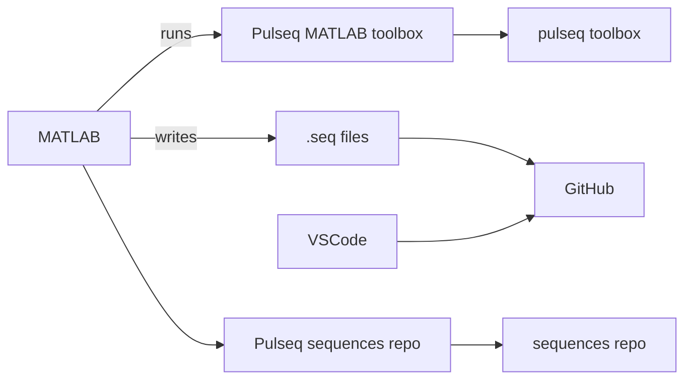
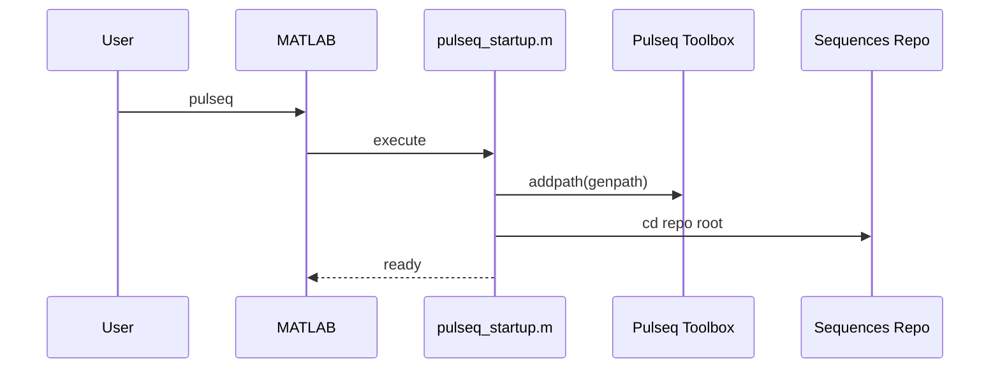
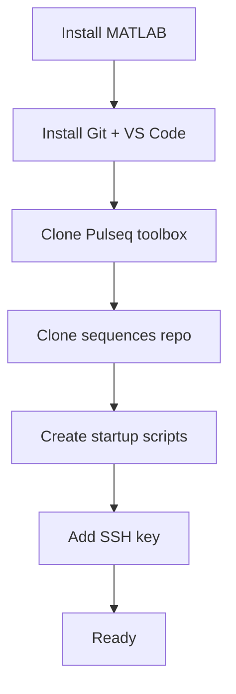

# Pulseq Development Environment Setup  
**Windows · MATLAB · VS Code · GitHub**

This document describes how to set up a **reproducible Pulseq development environment** on a Windows PC.  
The setup is intentionally explicit and minimal, so it can be duplicated reliably on another machine.

---

## Overview



Key design principles:
- MATLAB runs **natively on Windows**
- Pulseq toolbox is **not version-controlled**
- Sequences **are version-controlled**
- Pulseq is enabled **on demand**
- No reliance on `\\wsl$` paths for MATLAB

---

## 1. Software prerequisites

### 1.1 MATLAB (Windows)
Install MATLAB normally using the MathWorks installer.

⚠️ **Do not install MATLAB inside WSL**  
MATLAB must be a native Windows install.

---

### 1.2 Git for Windows
Download and install:

https://git-scm.com/download/win

Important installer options:
- ✔ **Git from the command line and also from 3rd-party software**
- ✔ Checkout Windows-style, commit Unix-style line endings

Verify:
```powershell
git --version
```

---

### 1.3 Visual Studio Code
Install from:

https://code.visualstudio.com/

Recommended extensions:
- MATLAB (MathWorks)
- GitLens (optional)

---

## 2. Directory layout (canonical)

### 2.1 Pulseq MATLAB toolbox (not versioned)
```
D:\pulseq\matlab
```

Clone once:
```powershell
git clone https://github.com/pulseq/pulseq.git D:\pulseq
```

---

### 2.2 Pulseq sequences repository (versioned)
```
D:\Repos\pulseq-sequences
```

Recommended structure:
```
pulseq-sequences/
├─ matlab/
│  ├─ pulseq_startup.m
│  ├─ demo_*.m
├─ seq/
├─ docs/
├─ README.md
```

---

## 3. MATLAB user directory

In MATLAB:
```matlab
userpath
```

If it does not exist:
```matlab
mkdir(userpath)
```

---

## 4. On-demand Pulseq activation



---

## 5. Repo-local startup script

**File**
```
D:\Repos\pulseq-sequences\matlab\pulseq_startup.m
```

```matlab
function pulseq_startup()
    pulseqToolbox = 'D:\pulseq\matlab';
    seqRepo       = 'D:\Repos\pulseq-sequences';

    assert(exist(pulseqToolbox,'dir')==7);
    addpath(genpath(pulseqToolbox));

    assert(exist(seqRepo,'dir')==7);
    cd(seqRepo);

    fprintf('Pulseq toolbox: %s\n', pulseqToolbox);
    fprintf('Repo: %s\n', seqRepo);
    fprintf('mr.Sequence: %s\n', which('mr.Sequence'));

    disp('Pulseq environment ready.');
end
```

---

## 6. Optional one-word launcher

**File**
```
C:\Users\User\Documents\MATLAB\pulseq.m
```

```matlab
function pulseq()
    addpath('D:\Repos\pulseq-sequences\matlab')
    pulseq_startup
end
```

---

## 7. Daily workflow

```matlab
pulseq
```

---

## 8. GitHub SSH (Windows)

```powershell
ssh-keygen -t ed25519 -C "yourname@windows"
Get-Service ssh-agent | Set-Service -StartupType Automatic
Start-Service ssh-agent
ssh-add ~/.ssh/id_ed25519
```

Verify:
```powershell
ssh -T git@github.com
```

---

## 9. Sanity checks

```matlab
which mr.Sequence
pwd
```

---

## 10. New machine checklist


